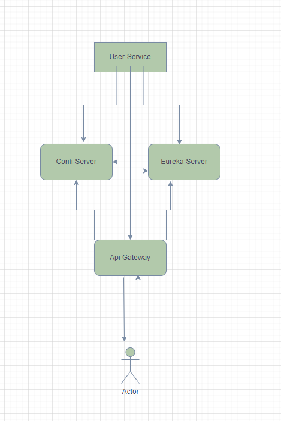
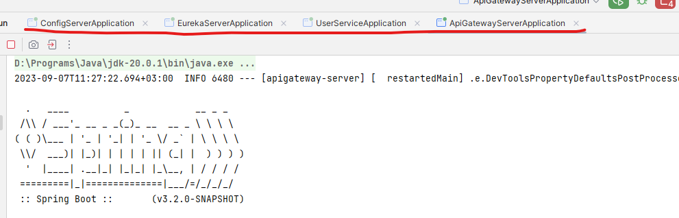
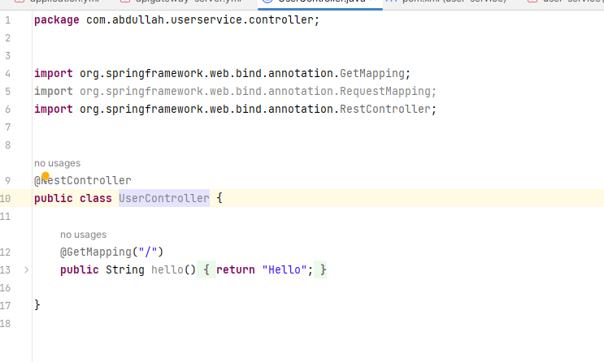
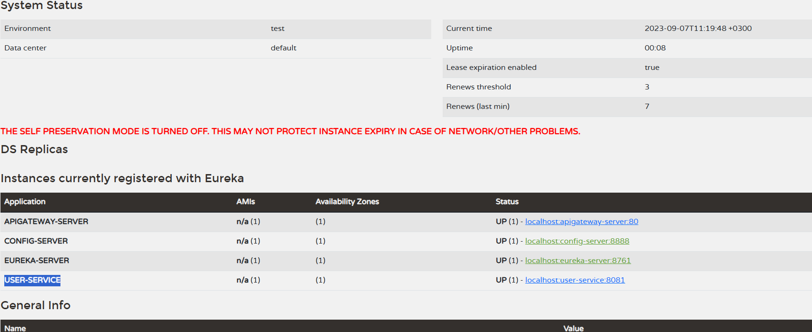
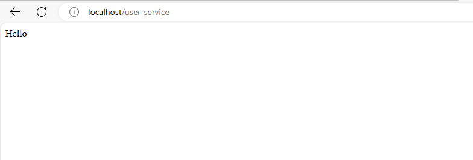

# Micro Service App

Spring boot ile basit microservice uygulaması yaptık

### Çalıştırmak için 

```
git clone https://github.com/abdullahciftci034/MicroServiceApp.git
```
Her servisleri ayrı ayrı çalıştırın

Sırası ile servislerimizi çalıştıralım

- config-server
- eureka-server
- user-serive
- apigateway-server

```
mvn spring-boot:run 
```

Servislerdeki konfigurasyon dosyalarına erişmek için
```
http://localhost:8888/{servis ismi}
```
Eureka-servera erişmek için
```
http://localhost:8761
```

Apigateway deki sonuc için

<a href="http://localhost/user-service">http://localhost/user-service</a>


### Preview




